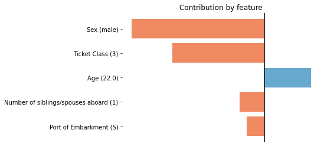

<p align="left">

<i>An open source project from Data to AI Lab at MIT.</i>
</p>

<!-- Uncomment these lines after releasing the package to PyPI for version and downloads badges -->
<!--[](https://pypi.python.org/pypi/pyreal)-->
<!--[](https://pepy.tech/project/pyreal)-->
<!--[](https://travis-ci.org/DAI-Lab/pyreal)-->
[](https://codecov.io/gh/DAI-Lab/pyreal)
[](https://github.com/DAI-Lab/pyreal/actions)
# Pyreal

Library for evaluating and deploying machine learning explanations.

- Free software: Not open source
- Documentation: https://sibyl-dev.github.io/pyreal
- Homepage: https://github.com/sibyl-dev/pyreal

# Overview

**Pyreal** wraps the complete machine learning explainability pipeline into Explainer objects. Explainer objects
handle all the transforming logic, in order to provide a human-interpretable explanation from any original
data form.

# Install

## Requirements

**Pyreal** has been developed and tested on [Python 3.7 and 3.8](https://www.python.org/downloads/)

Also, although it is not strictly required, the usage of a [virtualenv](https://virtualenv.pypa.io/en/latest/)
is highly recommended in order to avoid interfering with other software installed in the system
in which **Pyreal** is run.

These are the minimum commands needed to create a virtualenv using python3.6 for **Pyreal**:

```bash
pip install virtualenv
virtualenv -p $(which python3.6) pyreal-venv
```

Afterwards, you have to execute this command to activate the virtualenv:

```bash
source pyreal-venv/bin/activate
```

Remember to execute it every time you start a new console to work on **Pyreal**!

<!-- Uncomment this section after releasing the package to PyPI for installation instructions
## Install from PyPI

After creating the virtualenv and activating it, we recommend using
[pip](https://pip.pypa.io/en/stable/) in order to install **Pyreal**:

```bash
pip install pyreal
```

This will pull and install the latest stable release from [PyPI](https://pypi.org/).
-->

## Install from source

With your virtualenv activated, you can clone the repository and install it from
source by running `make install` on the `stable` branch:

```bash
git clone git@github.com:DAI-Lab/pyreal.git
cd pyreal
git checkout stable
make install
```

<!--## Install for Development

If you want to contribute to the project, a few more steps are required to make the project ready
for development.

Please head to the [Contributing Guide](https://DAI-Lab.github.io/pyreal/contributing.html#get-started)
for more details about this process.-->

# Quickstart

In this short tutorial we will guide you through a series of steps that will help you
getting started with **Pyreal**. We will get an explanation for a prediction on whether a
passenger on the Titanic would have survived.

 For a more detailed version of this tutorial, see
`examples.titanic.titanic_lfc.ipynb`

#### Load in demo dataset, pre-fit model, and transformers
```python3
import pyreal.applications.titanic as titanic
from pyreal.utils.transformer import ColumnDropTransformer, MultiTypeImputer

# Load in data
x_train_orig, y = titanic.load_titanic_data()

# Load in feature descriptions -> dict(feature_name: feature_description, ...)
feature_descriptions = titanic.load_feature_descriptions()

# Load in model
model = titanic.load_titanic_model()

# Load in list of transformers
transformers = titanic.load_titanic_transformers()
```

#### Create and fit LocalFeatureContribution Explainer object
```python3
from pyreal.explainers import LocalFeatureContribution
lfc = LocalFeatureContribution(model=model, x_train_orig=x_train_orig,
                               m_transforms=transformers, e_transforms=transformers,
                               feature_descriptions=feature_descriptions, fit_on_init=True)
lfc.fit()
```

#### Make predictions on an input
```python3
input_to_explain = x_train_orig.iloc[0]
prediction = lfc.model_predict(input_to_explain) # Prediction: [0]
```

#### Explain an input
```python3
contributions = lfc.produce(input_to_explain)
```

#### Visualize the explanation
```python3
from pyreal.utils import visualize
x_interpret = lfc.convert_data_to_interpretable(input_to_explain)

# Plot a bar plot of top contributing features, by asbolute value
visualize.plot_top_contributors(contributions, select_by="absolute", values=x_interpret)
```

The output will be a bar plot showing the most contributing features, by absolute value.



We can see here that the input passenger's predicted chance of survival was greatly reduced
because of their sex (male) and ticket class (3rd class).

# What's next?

For more details about **Pyreal** and all its possibilities
and features, please check the [documentation site](
https://DAI-Lab.github.io/pyreal/).
